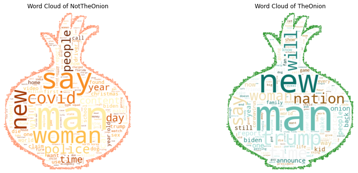
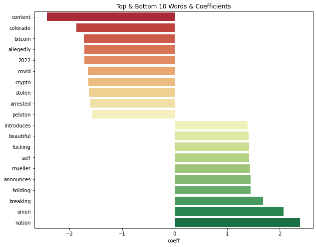
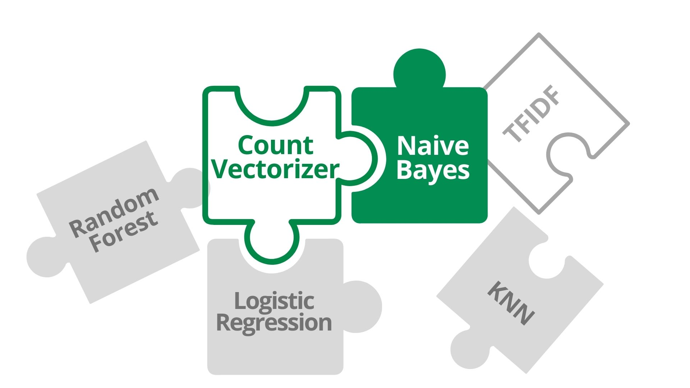

# Fake News Subreddit Prediction using Natural Language Processing and Classification Predictive Modeling

# Introduction

### Background

Reddit is a social news website and forum where content is socially curated and promoted by site members through voting. Posts are organized by subject into user-created boards called "communities" or "subreddits", which cover a wide variety of topics. Ranked among the most popular mobile social apps in the United States, Reddit has more than 48 million monthly active users (as of June 2021). Its prominence and popularity makes it a good data source for this project.

### Problem Statement

Fake news is a prevalent and harmful problem in our modern society, often misleading the general public on important topics such as healthcare and defense. This can lead to societal issues which is detrimental to our society. More than making people believe false things, the rise of fake news is making it harder for people to see the truth.

In view of this menace, we aim to develop a model that is discerning enough to separate real news from fake news, so that government bodies can weed out the fake news, thus creating a secure, and more misinformation-resilient society in the long tern. We want to create a model that will help us to identify real and fake news based on the title of a post.

Titles are a strong differentiating factor between fake and real news. In general, fake news has very little information or substance in the article content but packs a ton of information into the titles. Titles are often the determining factor on whether someone will click on or read the article.

To tackle the problem, we will foucus on text-based news from subreddit `r/TheOnion` and `r/nottheonion`, using natural language processing and machine learning models to predict whether an article is from `r/TheOnion` (fake news) or from `r/nottheonion` (real news). 

- [r/TheOnion](https://www.reddit.com/r/TheOnion/): a subreddit that lists **satire** news or **fake** stories that are ridiculous, written in such a way that makes it seem plausible.
- [r/NotTheOnion](https://www.reddit.com/r/nottheonion/): a subreddit that lists **real** news stories so absurd that one could honestly believe they were from `TheOnion`

### Goal 

Our team aims to develop a model using natural language processing and machine learning models to predict whether an article is from `r/TheOnion` (fake news) or `r/NotTheOnion` (real news). 

After scraping posts from the two subreddits: `TheOnion` and `NotTheOnion`, we will use Natural Language Processing (NLP) to train a classification model to identify which subreddit a given post came from, based on the title of a post.

### Evaluation of Success
- Model score
- High F1 score

# Methodology

### Data Scraping from Reddit

   To get the necessary posts for this project, we have scrapped at least 5000 posts (before 1 Jan 2022) from each subreddit.
  
### Data Cleaning & EDA
    
 The following was done during data cleaning:
   - Removed links
   - Removed non-alphabetical/numberical and single character words
   - Lemmatization and Tokenization
   - Dropped duplicates

 
 Wordclouds after data cleaning

# Building & Fitting Models

We have tried different combination of vectorizers and models and used `Pipeline` and `GridSearchCV` to achieve the model with the best accuracy (based on score):

| # | Model | Score |
| --- | --- | --- |
| 1 | Count Vectorizer + Multinomial Naive Bayes	| 0.811 |
| 2 | TFIDF + Multinomial Naive Bayes | 0.793 |
| 3 | Count Vectorizer + Logistic Regression | 0.795 |
| 4 | TFIDF + Logistic Regression | 0.797 |
| 5 | Count Vectorizer + Random Forest	| 0.754 |
| 6 | TFIDF + Random Forest	| 0.754 |

### Best Model
   
#### Based on Interpretability

An interpretable model helps us fundamentally understand the value and accuracy of our findings.

To interpret model coefficients, we have chosen `Count Vectorizer` and `Logistic Regression` Model. We were able to interpret model coefficients and identify the top words that contribute the most positively to the following subreddits. Using the model coefficients that we have found, we are able to find the effect (no. of times) of a word occurence on the model classification.

| Subreddit: | `NotTheOnion` | `TheOnion` |
| --- | --- | --- |
| # 1 | nation (10.91x) | content (11.36x) |
| # 2 | onion (7.92x) | colorado (6.49x) |
| # 3 | onion (5.37x) | bitcoin (5.64x) |

*(i.e. A post with the word "nation" will be 10.91 times more likely to be from the `NotTheOnion` subreddit.)*

However, our goal here is to create an accurate model with a low F1 score, given the impact of both FPs and FNs are equally detrimental. Hence, we want to find a model that gives the best score.  

       
#### Based on Accuracy

The model that gives the best score is `Count Vectorizer` and `Multinomial Naive Bayes` model, with the parameters:
- `ngram_range`: (1,2)
- `alpha`: 1.95

The best score is 0.812 (81.2% accuracy), which is a good improvement in comparison to our baseline model, which has an score of 0.5 (50% accuracy).

# Conclusion
### Recommendations
  

- `Count Vectorizer` and `Multinomial Naive Bayes` model 
   - gives the best F1 score (minimised False Positives and False Negatives)
   - simple, easy to implement
   - good and accurate text classification prediction 

### Problems
- Model is overfitted to the training set
   - Train score (0.984) is significantly higher than the Test Score (0.824), which amounts to a ~16% difference in accuracy. 
   - However, since we are optimizing for accuracy, more importantly we want choose a model with the highest percentage of correct predictions.
- Our model is limited to English words only
- Model might not be a good representative of the content for future subreddit posts
   - New words and acronyms, recentness of the terms used
   - Topic of interest changes with current events and time periods

A well-rounded model should take into account the other features or recognize the type of content discussed in a subreddit thread, not just words.

### Possible Enhancements
- Consider non-text posts (i.e. images, videos)
- Explore other features of a post (i.e. subtexts, comments, upvotes)
- Analysing post authors' posting history and patterns
- Content-based analysis, as further exploration is needed to better understand the content of the posts, not just individual words. With that in mind, we may explore other NLP methods (e.g. [BERT](https://www.analyticsvidhya.com/blog/2019/09/demystifying-bert-groundbreaking-nlp-framework/), a transformer-based machine learning technique for NLP pre-training developed by Google; it considers both the left and the right side of a token’s context before making a prediction.)
 
